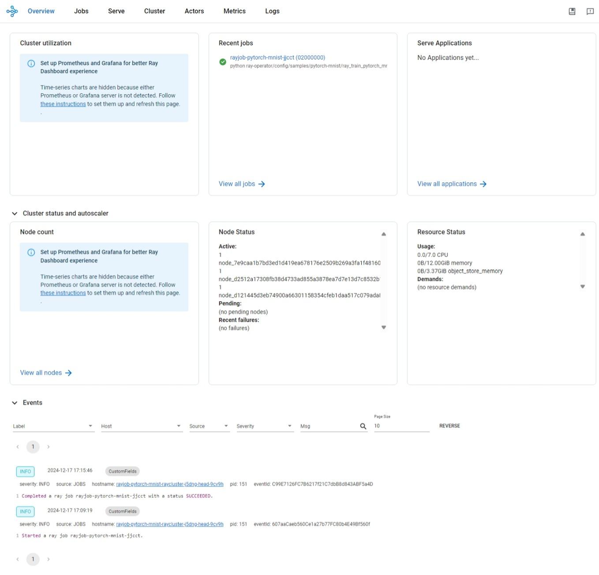

# Ray on Azure Kubernetes Service (AKS)

In this article, we will deploy a Ray cluster on an Azure Kubernetes Service (AKS) cluster using the KubeRay operator. You will use the Ray Cluster to train a simple machine learning model and display the results on the Ray Dashboard running on the AKS cluster.

## What is Ray?

Ray is an open-source project developed at UC Berkeley's RISE Lab that provides a unified framework for scaling AI and Python applications. It consists of a core distributed runtime and a set of AI libraries designed to accelerate machine learning workloads. Ray simplifies the process of running compute-intensive Python tasks at massive scale, allowing developers to seamlessly scale their applications from a single laptop to a large cluster. The framework supports various machine learning tasks, including distributed training, hyperparameter tuning, reinforcement learning, and production model serving. You can find out more about Ray [here](https://github.com/ray-project/ray).

## What is KubeRay?

KubeRay is an open-source project that provides a Kubernetes operator for deploying and managing Ray clusters on Kubernetes. The operator simplifies the process of deploying and managing Ray clusters on Kubernetes by automating the deployment, scaling, and monitoring of Ray clusters. It provides a declarative way to define Ray clusters using Kubernetes custom resources, making it easy to manage Ray clusters alongside other Kubernetes resources. You can find out more about KubeRay [here](https://github.com/ray-project/kuberay).

## Prerequisites

Before you begin, you will need the following:

1. An Azure subscription. If you don't have an Azure subscription, you can create a free account [here](https://azure.microsoft.com/free/).
1. The Azure CLI installed on your local machine. You can install the Azure CLI by following the instructions [here](https://docs.microsoft.com/cli/azure/install-azure-cli).
1. The [Azure Kubernetes Service Preview extension](https://learn.microsoft.com/azure/aks/draft#install-the-aks-preview-azure-cli-extension) must be installed.
1. [Helm](https://helm.sh/docs/intro/install/) must be installed.
1. [Terraform client tools](https://developer.hashicorp.com/terraform/install) or [OpenTofu](https://opentofu.org/) must be installed. This guide makes use of Terrafrom, however the modules used should be compatible with OpenTofu.

## Deploy Sample to AKS (Complete)

The sample includes a script that will:

1. Use Terraform to create a local plan file to define the desired state for infrastructure required AKS Infrastructure that consists of an Azure Resource Group, a dedicated system node pool, and a workload node pool for Ray with three nodes.
1. Deploys a local Terraform plan to Azure.
1. Retrieve outputs from the Terraform deployment and obtains k8s credentials to the newly deployed AKS Cluster.
1. Installs Helm Ray repository and deploys [Ray Operator (KubeRay)](https://docs.ray.io/en/latest/cluster/kubernetes/index.html) to the AKS cluster via Helm.
1. Downloads and executes a [Ray Job](https://docs.ray.io/en/latest/cluster/running-applications/job-submission/index.html) YAML manifest from the Ray Github samples repo to perform an Image classification ([MNIST](https://github.com/cvdfoundation/mnist) dataset) using Convnets ([convolutional neural network](https://techcommunity.microsoft.com/discussions/machinelearning/what-is-convolutional-neural-network-%E2%80%94-cnn-deep-learning/4184725)).
1. Outputs the logs from the Ray job presenting an overview of the machine learning process performed by Ray.

Clone the repo locally and change to the root of the local repo. To execute the sample end to end non-interatively run the following command:

```bash
chmod +x deploy.sh  
./deploy.sh   
```

Review the output of the logs and view the resource group in the Azure Portal to review the infrastructure that was created.

## Manually Deploy Sample to AKS (Step-by-Step)

Fashion MNIST is a dataset of Zalando's article images—consisting of a training set of 60,000 examples and a test set of 10,000 examples. Each example is a 28x28 grayscale image, associated with a label from 10 classes. We will train a simple PyTorch model on this dataset using the Ray cluster.

To train the model, we will submit a Ray Job specification to the KubeRay operator running on our private AKS cluster. The Ray Job specification is a YAML file that describes the resources required to run the job, including the Docker image, the command to run, and the number of workers to use.

Download the Ray Job specification file by running the following command:

```bash
curl -LO https://raw.githubusercontent.com/ray-project/kuberay/master/ray-operator/config/samples/pytorch-mnist/ray-job.pytorch-mnist.yaml
```

Looking at the RayJob description, you may need to modify some fields to match your environment:

- The `replicas` field under the `workerGroupSpecs` section in `rayClusterSpec` specifies the number of worker pods that KubeRay schedules to the Kubernetes cluster. Each worker pod requires 3 CPUs and 4GB of memory. The head pod requires 1 CPU and 4GB of memory. Setting the `replicas` field to 2 will require 8 vCPUs in the nodepool used to implement the RayCluster for the job.

- The `NUM_WORKERS` field under `runtimeEnvYAML` in `spec` specifies the number of Ray actors to launch. Each Ray actor must be serviced by a worker pod in the Kubernetes cluser. Therefore, the `NUM_WORKERS` field must be less than or equal to the `replicas` field. In this example, we set `NUM_WORKERS` to 2, which matches the `replicas` field.

- The `CPUS_PER_WORKER` field must be set to less than or equal the number of CPUs allocated to each worker pod minus 1. In this example, the CPU resource request per worker pod is 3, so `CPUS_PER_WORKER` is set to 2.

To summarize, you will need a total of 8 vCPUs in the nodepool to run the PyTorch model training job. Since we added a taint on the system node pool so that no user pods can be scheduled on it, we must create a new node pool with at least 8 vCPUs to host the Ray cluster.

Launch the PyTorch model training job by running the following command:

```bash
kubectl apply -n kuberay -f ray-job.pytorch-mnist.yaml
```

Verify that you have 2 worker pods and 1 head pod running in the namespace by running the following command:

```bash
 kubectl get pods -n kuberay
 ```

 You should see something like the following:

 ```text
 NAME                                                      READY   STATUS    RESTARTS   AGE
kuberay-operator-7d7998bcdb-9h8hx                         1/1     Running   0          3d2h
pytorch-mnist-raycluster-s7xd9-worker-small-group-knpgl   1/1     Running   0          6m15s
pytorch-mnist-raycluster-s7xd9-worker-small-group-p74cm   1/1     Running   0          6m15s
rayjob-pytorch-mnist-fc959                                1/1     Running   0          5m35s
rayjob-pytorch-mnist-raycluster-s7xd9-head-l24hn          1/1     Running   0          6m15s
```

Notice there are 2 worker pods and 1 head pod running in the namespace.

Now check the status of the RayJob by running the following command:

```bash
kubectl get rayjob -n kuberay
```

You should see the something like the following output:

```text
NAME                   JOB STATUS   DEPLOYMENT STATUS   START TIME             END TIME   AGE
rayjob-pytorch-mnist   RUNNING      Running             2024-11-22T03:08:22Z              9m36s
```

Wait until the RayJob completes. This may take a few minutes. When the JOB STATUS is `SUCCEEDED`, you can check the training logs. You can do this by first getting the name of the pod running the RayJob by running the following command:

```bash
kubectl get pods -n kuberay
```

You should see a pod whose name starts with `rayjob-pytorch-mnist`, similar to what is shown here:
  
```text
NAME                                                      READY   STATUS      RESTARTS   AGE
kuberay-operator-7d7998bcdb-9h8hx                         1/1     Running     0          3d2h
pytorch-mnist-raycluster-s7xd9-worker-small-group-knpgl   1/1     Running     0          14m
pytorch-mnist-raycluster-s7xd9-worker-small-group-p74cm   1/1     Running     0          14m
rayjob-pytorch-mnist-fc959                                0/1     Completed   0          13m
rayjob-pytorch-mnist-raycluster-s7xd9-head-l24hn          1/1     Running     0          14m
```

To view the logs of the RayJob, run the following command (make sure to replace `rayjob-pytorch-mnist-fc959` with the name of the pod running your RayJob):

```bash
kubectl logs -n kuberay rayjob-pytorch-mnist-fc959
```

To view the logs of the RayJob, run the following command (make sure to replace `rayjob-pytorch-mnist-fc959` with the name of the pod running your RayJob):

```bash
kubectl logs -n kuberay rayjob-pytorch-mnist-fc959
```

You should see the training logs for the PyTorch model. The logs will look something like this:

```text
2024-11-21 19:09:04,986 INFO cli.py:39 -- Job submission server address: http://rayjob-pytorch-mnist-raycluster-s7xd9-head-svc.kuberay.svc.cluster.local:8265
2024-11-21 19:09:05,712 SUCC cli.py:63 -- -------------------------------------------------------
2024-11-21 19:09:05,713 SUCC cli.py:64 -- Job 'rayjob-pytorch-mnist-hndpx' submitted successfully
2024-11-21 19:09:05,713 SUCC cli.py:65 -- -------------------------------------------------------
2024-11-21 19:09:05,713 INFO cli.py:289 -- Next steps
2024-11-21 19:09:05,713 INFO cli.py:290 -- Query the logs of the job:
2024-11-21 19:09:05,713 INFO cli.py:292 -- ray job logs rayjob-pytorch-mnist-hndpx
2024-11-21 19:09:05,713 INFO cli.py:294 -- Query the status of the job:
...

View detailed results here: /home/ray/ray_results/TorchTrainer_2024-11-21_19-11-23
To visualize your results with TensorBoard, run: `tensorboard --logdir /tmp/ray/session_2024-11-21_19-08-24_556164_1/artifacts/2024-11-21_19-11-24/TorchTrainer_2024-11-21_19-11-23/driver_artifacts`

Training started with configuration:
╭─────────────────────────────────────────────────╮
│ Training config                                 │
├─────────────────────────────────────────────────┤
│ train_loop_config/batch_size_per_worker      16 │
│ train_loop_config/epochs                     10 │
│ train_loop_config/lr                      0.001 │
╰─────────────────────────────────────────────────╯
(RayTrainWorker pid=1193, ip=10.244.4.193) Setting up process group for: env:// [rank=0, world_size=2]
(TorchTrainer pid=1138, ip=10.244.4.193) Started distributed worker processes:
(TorchTrainer pid=1138, ip=10.244.4.193) - (node_id=3ea81f12c0f73ebfbd5b46664e29ced00266e69355c699970e1d824b, ip=10.244.4.193, pid=1193) world_rank=0, local_rank=0, node_rank=0
(TorchTrainer pid=1138, ip=10.244.4.193) - (node_id=2b00ea2b369c9d27de9596ce329daad1d24626b149975cf23cd10ea3, ip=10.244.1.42, pid=1341) world_rank=1, local_rank=0, node_rank=1
(RayTrainWorker pid=1341, ip=10.244.1.42) Downloading http://fashion-mnist.s3-website.eu-central-1.amazonaws.com/train-images-idx3-ubyte.gz
(RayTrainWorker pid=1193, ip=10.244.4.193) Downloading http://fashion-mnist.s3-website.eu-central-1.amazonaws.com/train-images-idx3-ubyte.gz to /home/ray/data/FashionMNIST/raw/train-images-idx3-ubyte.gz
(RayTrainWorker pid=1193, ip=10.244.4.193)
  0%|          | 0.00/26.4M [00:00<?, ?B/s]
(RayTrainWorker pid=1193, ip=10.244.4.193)
  0%|          | 65.5k/26.4M [00:00<01:13, 356kB/s]
(RayTrainWorker pid=1193, ip=10.244.4.193)
100%|██████████| 26.4M/26.4M [00:01<00:00, 18.9MB/s]
(RayTrainWorker pid=1193, ip=10.244.4.193) Extracting /home/ray/data/FashionMNIST/raw/train-images-idx3-ubyte.gz to /home/ray/data/FashionMNIST/raw
(RayTrainWorker pid=1341, ip=10.244.1.42)
100%|██████████| 26.4M/26.4M [00:01<00:00, 18.7MB/s]
...
Training finished iteration 1 at 2024-11-21 19:15:46. Total running time: 4min 22s
╭───────────────────────────────╮
│ Training result               │
├───────────────────────────────┤
│ checkpoint_dir_name           │
│ time_this_iter_s        144.9 │
│ time_total_s            144.9 │
│ training_iteration          1 │
│ accuracy                0.805 │
│ loss                  0.52336 │
╰───────────────────────────────╯
(RayTrainWorker pid=1193, ip=10.244.4.193)
Test Epoch 0:  97%|█████████▋| 303/313 [00:01<00:00, 269.60it/s]
Test Epoch 0: 100%|██████████| 313/313 [00:01<00:00, 267.14it/s]
(RayTrainWorker pid=1193, ip=10.244.4.193)
Train Epoch 1:   0%|          | 0/1875 [00:00<?, ?it/s]
(RayTrainWorker pid=1341, ip=10.244.1.42)
Test Epoch 0: 100%|██████████| 313/313 [00:01<00:00, 270.44it/s]
(RayTrainWorker pid=1341, ip=10.244.1.42)
Train Epoch 0: 100%|█████████▉| 1866/1875 [00:24<00:00, 82.49it/s] [repeated 35x across cluster]
(RayTrainWorker pid=1193, ip=10.244.4.193)
Train Epoch 0: 100%|██████████| 1875/1875 [00:24<00:00, 77.99it/s]
Train Epoch 0: 100%|██████████| 1875/1875 [00:24<00:00, 76.19it/s]
(RayTrainWorker pid=1193, ip=10.244.4.193)
Test Epoch 0:   0%|          | 0/313 [00:00<?, ?it/s]
(RayTrainWorker pid=1193, ip=10.244.4.193)
Test Epoch 0:  88%|████████▊ | 275/313 [00:01<00:00, 265.39it/s] [repeated 19x across cluster]
(RayTrainWorker pid=1341, ip=10.244.1.42)
Train Epoch 1:  19%|█▉        | 354/1875 [00:04<00:18, 82.66it/s] [repeated 80x across cluster]
(RayTrainWorker pid=1341, ip=10.244.1.42)
Train Epoch 1:   0%|          | 0/1875 [00:00<?, ?it/s]
(RayTrainWorker pid=1341, ip=10.244.1.42)
Train Epoch 1:  40%|████      | 757/1875 [00:09<00:13, 83.01it/s] [repeated 90x across cluster]
(RayTrainWorker pid=1341, ip=10.244.1.42)
Train Epoch 1:  62%|██████▏   | 1164/1875 [00:14<00:08, 83.39it/s] [repeated 92x across cluster]
(RayTrainWorker pid=1341, ip=10.244.1.42)
Train Epoch 1:  82%|████████▏ | 1533/1875 [00:19<00:05, 68.09it/s] [repeated 91x across cluster]
(RayTrainWorker pid=1341, ip=10.244.1.42)
Train Epoch 1:  91%|█████████▏| 1713/1875 [00:22<00:02, 70.20it/s]
(RayTrainWorker pid=1193, ip=10.244.4.193)
Train Epoch 1:  91%|█████████ | 1707/1875 [00:22<00:02, 70.04it/s] [repeated 47x across cluster]
(RayTrainWorker pid=1341, ip=10.244.1.42)
Test Epoch 1:   0%|          | 0/313 [00:00<?, ?it/s]
(RayTrainWorker pid=1341, ip=10.244.1.42)
Test Epoch 1:   8%|▊         | 24/313 [00:00<00:01, 237.98it/s]
(RayTrainWorker pid=1193, ip=10.244.4.193)
Test Epoch 1:  96%|█████████▋| 302/313 [00:01<00:00, 250.76it/s]
Test Epoch 1: 100%|██████████| 313/313 [00:01<00:00, 262.94it/s]
(RayTrainWorker pid=1193, ip=10.244.4.193)
Train Epoch 2:   0%|          | 0/1875 [00:00<?, ?it/s]
(RayTrainWorker pid=1341, ip=10.244.1.42)
Test Epoch 1:  92%|█████████▏| 289/313 [00:01<00:00, 222.57it/s]

Training finished iteration 2 at 2024-11-21 19:16:12. Total running time: 4min 48s
╭───────────────────────────────╮
│ Training result               │
├───────────────────────────────┤
│ checkpoint_dir_name           │
│ time_this_iter_s       25.975 │
│ time_total_s          170.875 │
│ training_iteration          2 │
│ accuracy                0.828 │
│ loss                  0.45946 │
╰───────────────────────────────╯
(RayTrainWorker pid=1341, ip=10.244.1.42)
Test Epoch 1: 100%|██████████| 313/313 [00:01<00:00, 226.04it/s]
(RayTrainWorker pid=1193, ip=10.244.4.193)
Train Epoch 1: 100%|██████████| 1875/1875 [00:24<00:00, 76.24it/s] [repeated 45x across cluster]
(RayTrainWorker pid=1341, ip=10.244.1.42)
Train Epoch 2:  13%|█▎        | 239/1875 [00:03<00:24, 67.30it/s] [repeated 64x across cluster]
(RayTrainWorker pid=1193, ip=10.244.4.193)
Test Epoch 1:   0%|          | 0/313 [00:00<?, ?it/s]
(RayTrainWorker pid=1341, ip=10.244.1.42)
Test Epoch 1:  85%|████████▍ | 266/313 [00:01<00:00, 222.54it/s] [repeated 20x across cluster]
(RayTrainWorker pid=1341, ip=10.244.1.42)
..

Training completed after 10 iterations at 2024-11-21 19:19:47. Total running time: 8min 23s
2024-11-21 19:19:47,596 INFO tune.py:1009 -- Wrote the latest version of all result files and experiment state to '/home/ray/ray_results/TorchTrainer_2024-11-21_19-11-23' in 0.0029s.

Training result: Result(
  metrics={'loss': 0.35892221605786073, 'accuracy': 0.872},
  path='/home/ray/ray_results/TorchTrainer_2024-11-21_19-11-23/TorchTrainer_74867_00000_0_2024-11-21_19-11-24',
  filesystem='local',
  checkpoint=None
)
(RayTrainWorker pid=1341, ip=10.244.1.42) Downloading http://fashion-mnist.s3-website.eu-central-1.amazonaws.com/t10k-labels-idx1-ubyte.gz [repeated 7x across cluster]
(RayTrainWorker pid=1341, ip=10.244.1.42) Downloading http://fashion-mnist.s3-website.eu-central-1.amazonaws.com/t10k-labels-idx1-ubyte.gz to /home/ray/data/FashionMNIST/raw/t10k-labels-idx1-ubyte.gz [repeated 7x across cluster]
(RayTrainWorker pid=1341, ip=10.244.1.42) Extracting /home/ray/data/FashionMNIST/raw/t10k-labels-idx1-ubyte.gz to /home/ray/data/FashionMNIST/raw [repeated 7x across cluster]
(RayTrainWorker pid=1341, ip=10.244.1.42)
Train Epoch 9:  91%|█████████ | 1708/1875 [00:21<00:01, 83.84it/s] [repeated 23x across cluster]
(RayTrainWorker pid=1341, ip=10.244.1.42)
Train Epoch 9: 100%|██████████| 1875/1875 [00:23<00:00, 78.52it/s] [repeated 37x across cluster]
(RayTrainWorker pid=1341, ip=10.244.1.42)
Test Epoch 9:   0%|          | 0/313 [00:00<?, ?it/s]
(RayTrainWorker pid=1193, ip=10.244.4.193)
Test Epoch 9:  89%|████████▉ | 278/313 [00:01<00:00, 266.46it/s] [repeated 19x across cluster]
(RayTrainWorker pid=1193, ip=10.244.4.193)
Test Epoch 9:  97%|█████████▋| 305/313 [00:01<00:00, 256.69it/s]
Test Epoch 9: 100%|██████████| 313/313 [00:01<00:00, 267.35it/s]
2024-11-21 19:19:51,728 SUCC cli.py:63 -- ------------------------------------------
2024-11-21 19:19:51,728 SUCC cli.py:64 -- Job 'rayjob-pytorch-mnist-hndpx' succeeded
2024-11-21 19:19:51,728 SUCC cli.py:65 -- ------------------------------------------
```

## View the Training Results on the Ray Dashboard

When the RayJob completes successfully, you can view the training results on the Ray Dashboard. The Ray Dashboard is a web-based interface that provides real-time monitoring and visualization of Ray clusters. You can use the Ray Dashboard to monitor the status of Ray clusters, view logs, and visualize the results of machine learning jobs. To access the Ray Dashboard, you will need to expose the Ray head service to the public internet. To do this, you will need to create a "service shim" to expose the Ray head service on port 80 instead of port 8265.

>Note: The `deploy.sh` described in the previous section will automatically expose the Ray head service to the public internet. The following steps are included in the `deploy.sh` script.

First, get the name of the Ray head service and save it in a shell variable by running the following command:

```bash
rayclusterhead=$(kubectl get service -n $kuberay_namespace | grep 'rayjob-pytorch-mnist-raycluster' | grep 'ClusterIP' | awk '{print $1}')
```

Next, create a service "shim" to expose the Ray head service on port 80 by running the following command:

```bash
kubectl expose service $rayclusterhead \
-n $kuberay_namespace \
--port=80 \
--target-port=8265 \
--type=NodePort \
--name=ray-dash
```

Create the ingress to expose the service "shim" using the ingress controller by running the following command:

```bash
cat <<EOF | kubectl apply -f -
apiVersion: networking.k8s.io/v1
kind: Ingress
metadata:
  name: ray-dash
  namespace: kuberay
  annotations:
    nginx.ingress.kubernetes.io/rewrite-target: /
spec:
  ingressClassName: webapprouting.kubernetes.azure.com
  rules:
  - http:
      paths:
      - backend:
          service:
            name: ray-dash
            port:
              number: 80
        path: /
        pathType: Prefix
EOF
```

Finally, get the public IP address of the ingress controller by running the following command:

```bash
kubectl get service -n app-routing-system
```

You should see the public IP address of the load balancer attached to the ingress controller. Copy the public IP address and paste it into a web browser. You should see the Ray Dashboard, which looks like this:



## Clean Up

To clean up the resources created in this guide, you can delete the Azure Resource Group that contains the AKS cluster.

## Contributors

- Russell de Pina (Principal Technical Program Manager - Microsoft)
- Kenneth Kilty (Principal Technical Program Manager - Microsoft)
